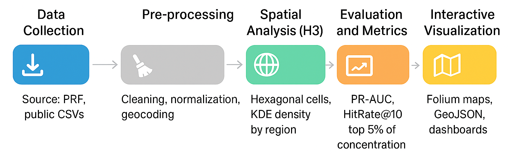

# 🛰️ Geospatial Traffic Accident Analysis using Artificial Intelligence

**Análise de Dados Geoespaciais e sua Aplicação na Identificação e Prevenção de Pontos Críticos de Acidentes de Trânsito usando Inteligência Artificial**

Este projeto aplica técnicas de **análise geoespacial** e **inteligência artificial (IA)** sobre dados da **Polícia Rodoviária Federal (PRF)** para **identificar hotspots** (áreas críticas de acidentes) e **prever ocorrências futuras**, auxiliando na formulação de políticas públicas e na prevenção de acidentes de trânsito.

---

## 📊 Objetivo

- Identificar áreas com **alta concentração de acidentes (hotspots)**;  
- Aplicar modelos preditivos para **antecipar regiões de risco**;  
- Gerar **mapas interativos** e **arquivos GeoJSON** para visualização geoespacial;  
- Avaliar a performance dos modelos com métricas como **PR-AUC** e **HitRate@100m**.  

---

## 🧠 Metodologia

O pipeline de processamento segue as seguintes etapas:

| Etapa | Descrição |
|-------|------------|
| **1️⃣ Coleta de Dados** | Extração de registros da PRF (CSV público com coordenadas e metadados dos acidentes). |
| **2️⃣ Pré-processamento** | Limpeza, normalização e geocodificação das colunas principais (data, latitude, longitude, gravidade, causa). |
| **3️⃣ Análise Espacial (H3)** | Agregação em células hexagonais (H3) e cálculo de densidade (KDE) para mapeamento de hotspots. |
| **4️⃣ Modelagem Preditiva** | Treinamento de modelos de aprendizado supervisionado (LightGBM, Gradient Boosting) com validação temporal. |
| **5️⃣ Avaliação e Visualização** | Cálculo de PR-AUC e HitRate@100m, exportação de GeoJSONs e criação de mapa interativo via Folium. |

---

## 🧩 Estrutura do Projeto

