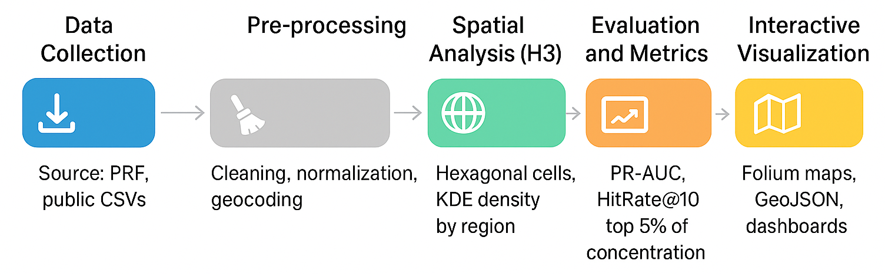

# 🛰️ Geospatial Traffic Accident Analysis using Artificial Intelligence

**Análise Computacional e Modelagem Preditiva de Acidentes de Trânsito com Dados Geoespaciais e Inteligência Artificial**

Este projeto aplica técnicas de **análise geoespacial** e **inteligência artificial (IA)** sobre dados da **Polícia Rodoviária Federal (PRF)** para **identificar hotspots** (áreas críticas de acidentes) e **prever ocorrências futuras**, auxiliando na formulação de políticas públicas e na prevenção de acidentes de trânsito.

---

## 📊 Objetivo

- Identificar áreas com **alta concentração de acidentes (hotspots)**;  
- Aplicar modelos preditivos para **antecipar regiões de risco**;  
- Gerar **mapas interativos** e **arquivos GeoJSON** para visualização geoespacial;  
- Avaliar a performance dos modelos com métricas como **PR-AUC** e **HitRate@100m**.  

---

## 🧠 Metodologia

O pipeline de processamento segue as seguintes etapas:

| Etapa | Descrição |
|-------|------------|
| **1️⃣ Coleta de Dados** | Extração de registros da PRF (CSV público com coordenadas e metadados dos acidentes). |
| **2️⃣ Pré-processamento** | Limpeza, normalização e geocodificação das colunas principais (data, latitude, longitude, gravidade, causa). |
| **3️⃣ Análise Espacial (H3)** | Agregação em células hexagonais (H3) e cálculo de densidade (KDE) para mapeamento de hotspots. |
| **4️⃣ Modelagem Preditiva** | Treinamento de modelos de aprendizado supervisionado (LightGBM, Gradient Boosting) com validação temporal. |
| **5️⃣ Avaliação e Visualização** | Cálculo de PR-AUC e HitRate@100m, exportação de GeoJSONs e criação de mapa interativo via Folium. |

<p align="center">
  
</p>

---

## ⚙️ Como Executar

### 1️⃣ Clonar o repositório
```bash
git clone https://github.com/SEU_USUARIO/ia_transito.git
cd ia_transito
```

### 2️⃣ Instalar dependências
Crie um ambiente virtual e instale os pacotes necessários:
pip install -r requirements.txt

📦 Bibliotecas principais:
pandas, geopandas, folium, scikit-learn, lightgbm, h3, shapely, numpy

### 3️⃣ Executar a análise
python Result.py

### 4️⃣ Ver os resultados

Os arquivos gerados ficam na pasta output_prf/:
- 🗺️ hotspots_prf.html – Mapa interativo com as áreas críticas;
- 🌐 GeoJSONs – Dados geoespaciais exportáveis;
- 📈 indicadores_resumo.csv – Métricas e estatísticas agregadas.

---

### 📏 Métricas Utilizadas
| Métrica                  | Descrição                                                                              |
| ------------------------ | -------------------------------------------------------------------------------------- |
| **PR-AUC**               | Avalia a precisão do modelo na detecção de células com risco de acidente.              |
| **HitRate@100m**         | Mede a proporção de acidentes reais dentro de um raio de 100m das previsões do modelo. |
| **Top 5% Concentration** | Indica a porcentagem de acidentes concentrada nas 5% células H3 mais críticas.         |

---

### 📚 Referências
- SENATRAN - Registro Nacional de Acidentes e Estatísticas de Trânsito (2023)
- OMS - Plano Global para a Década de Ação pela Segurança no Trânsito (2021-2030)
- Zhang, Y. et al. (2024). Geospatial and AI-based accident analysis.

---

### 📢 Sobre
Este projeto foi desenvolvido por Liliene P. Pereira, Glauber P. B. Souza e Carlos A. O. Freitas como parte do estudo
“Análise Computacional e Modelagem Preditiva de Acidentes de Trânsito com Dados Geoespaciais e Inteligência Artificial”.

📍 Universidade Federal do Amazonas (UFAM)                                                                                                                                
🧩 Instituto de Ciências Exatas e Tecnologias – ICET                                                                                              
📧 glauber.souza@ufam.edu.br; liliene.pereira@ufam.edu.br; carlosfreitas@ufam.edu.br;

---
🧾 Licença
Este projeto é distribuído sob a licença MIT License.
Sinta-se à vontade para usar, modificar e contribuir!

Made with ❤️ in Brazil | Data Science for Safer Roads

